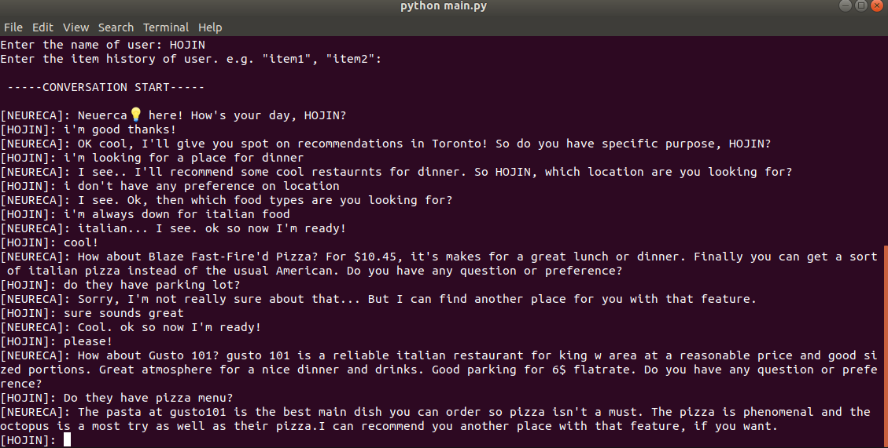
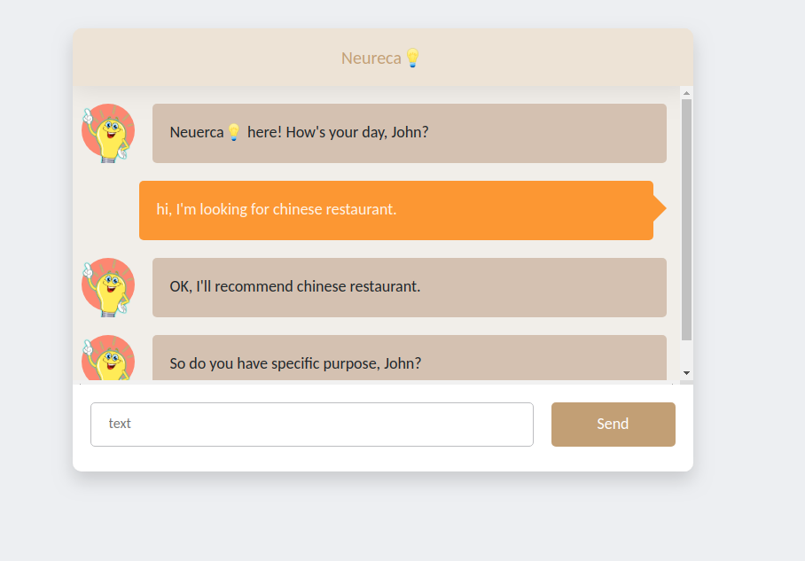

# <center>Neureca💡 for Conversational Recommender Systems</center>

This repository contains source code for Neureca💡 project. Neureca💡 is a framework for building conversational recommender (ConvRec) systems. It is also an open-source project that helps any ML researchers develop ConvRec system and contribute to key components easily. Neureca💡 is still under development stage.

## installation

```
pip install neureca
```

## usage
1. train NLU model(i.e. intent recognizer, item attribute recognizer) and Recommender model using your own dataset

```
neureca-train intent  
neureca-train attribute 
nuereca-train recommender
```
2. create main.py under your project directory


```python
from pathlib import Path
from neureca import Neureca, NLU, Recommender, Explainer, Manager
from stages import greeting_stage

# load the latest trained version of each model if version is not speicfied in arguament
nlu = NLU()  
recommender = Recommender()
explainer = Explainer()
dialogue_manager = Manager(initial_stage=greeting_stage)

#create neureca instance
neureca = Neureca(
    nlu=nlu,
    recommender=recommender,
    explainer=explainer,
    dialogue_manager=dialogue_manager,
    path=Path.cwd(),
)

if __name__ == '__main__':
    neureca.run(env="cli")  # env: cli or web
```
3. run neureca
```
python main.py
```



Also, Neureca also supports web interface: `neureca.run(env="web")`


For more information, please visit [docs](./docs).