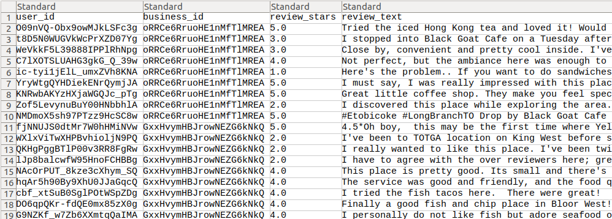

# Ratings Data

Rating data is used to train Neureca💡's `Recommder` model. In addtion, user's reviews in Rating data contained in this data is used to generate explanations in Neureca💡's `Explainer`.

Rating data must be provided as a csv file. As the example below, `ratings.csv` should have columns corresponding to user id, item id, rating, and review text in that order:

