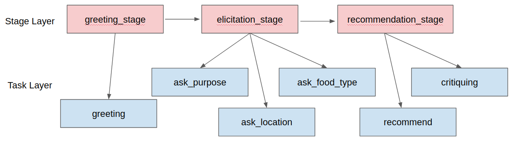

# Managing Dialogue Flow

 During conversaton, user's text goes through NLU module that interprets its intent and attribute information. `Dialogue Manager` determines the next appropriate utterance based on given information and previous conversation context. The dialog scenario plays an important role in determining the quality of the service. Therefore, good dialogue scenario design is essential for good service.

We claim that dialogue flow is hierarchical: The overall flow of conversation can be represented by a two-level hierarchical structure, `Stage` and `Task`.

Let's take the restaurant recommendation project as an example. The conversation flow would consist of three stages: the Greeting stage, the Preference Elicitation stage for extracting user's preference, and the Recommendation stage for recommendation and feedback. And each stage would consist of sub-tasks. For example, you can design your assistant to complete the tasks Asking for Opportunities, Asking Locations, and Asking Types of Food during the Preference Elicitation stage. 

