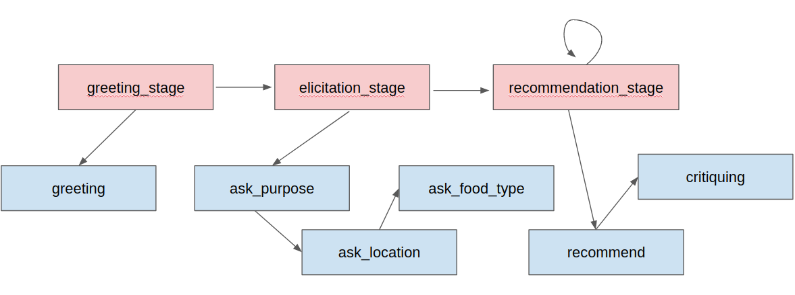
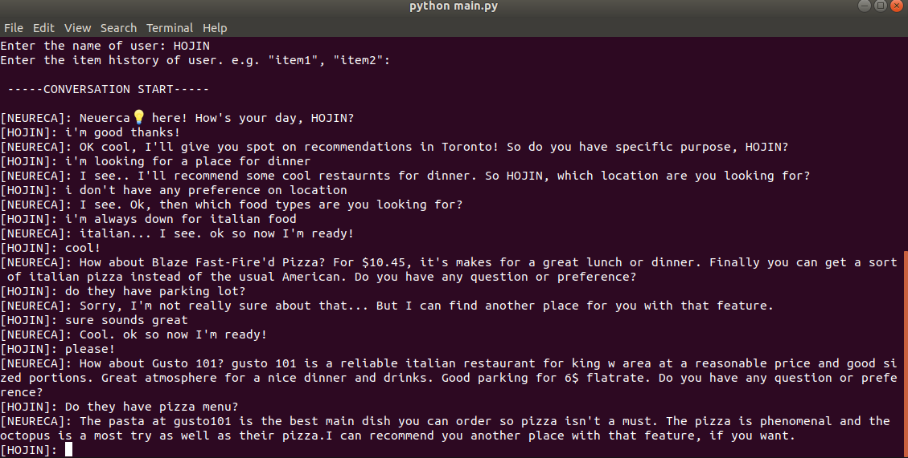

# Example: Building Restaurant Recommender Sysetem

## Project Directory Structure

Suppose you are creating a restaurant recommendation assistant. Your project directory should be structured as follow:

```
.
├── data
│   ├── attribute.yaml
│   ├── nlu.yaml
│   └── ratings.csv
├── main.py
├── stages.py
└── tasks
    ├── __init__.py
    ├── task_ask_food_type.py
    ├── task_ask_location.py
    ├── task_ask_occasion.py
    ├── task_critiquing.py
    ├── task_greeting.py
    └── task_recommend.py
```

The `data` folder should contain the three training data described before. Each file in `tasks` folder contains the implementation of corresponding task class. In `stages.py`, Stage classes are implemented as follows.


```python 
from neureca.dialogue_manager import Stage
from tasks import Greeting, AskOccasion, AskLocation, AskFoodType, Recommend, Critiquing


class GreetingStage(Stage):
    def get_start_task(self, user_belief):
        return "Greeting"

    def get_next_task(self, user_belief):
        return "Complete"


class ElicitationStage(Stage):
    def get_start_task(self, user_belief):
        return self.get_next_task(user_belief)

    def get_next_task(self, user_belief):
        if not user_belief.has_attribute("occasion"):
            return "AskOccasion"
        elif not user_belief.has_attribute("location"):
            return "AskLocation"
        elif not user_belief.has_attribute("food_type"):
            return "AskFoodType"
        return "Complete"


class RecommendationStage(Stage):
    def get_start_task(self, user_belief):
        self.critiquing_visited = False
        return "Recommend"

    def get_next_task(self, user_belief):
        if self.critiquing_visited is False:
            self.critiquing_visited = True
            return "Critiquing"
        else:
            self.critiquing_visited = False
            return "Complete"


greeting_stage = GreetingStage([Greeting()])
elicitation_stage = ElicitationStage([AskLocation(), AskOccasion(), AskFoodType()])
greeting_stage.next_stage = elicitation_stage
recommendation_stage = RecommendationStage([Recommend(), Critiquing()])
elicitation_stage.next_stage = recommendation_stage
recommendation_stage.next_stage = recommendation_stage
```



## Train NLU and Recommender
Run the following command on the project directory. 


```
#sh
neureca-train intent  
neureca-train attribute 
nuereca-train recommender
```


## Run Neureca


```python
from pathlib import Path
from neureca import Neureca, NLU, Recommender, Explainer, Manager
from stages import greeting_stage

# load the latest trained version of each model if version is not speicfied in arguament
nlu = NLU()  
recommender = Recommender()
explainer = Explainer()
dialogue_manager = Manager(initial_stage=greeting_stage)

#create nureca instance
neureca = Neureca(
    nlu=nlu,
    recommender=recommender,
    explainer=explainer,
    dialogue_manager=dialogue_manager,
    path=Path.cwd(),
)

if __name__ == '__main__':
    neureca.run(env="cli")  # env: cli or web
```

```
#sh
python main.py
```

